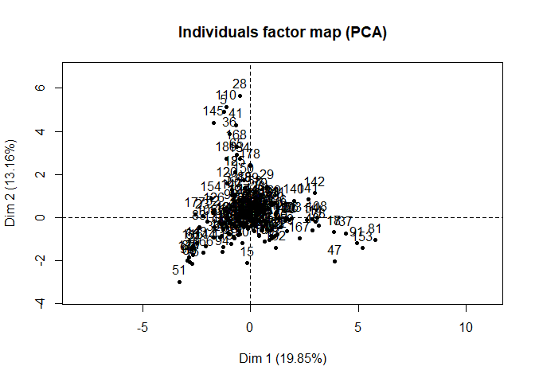
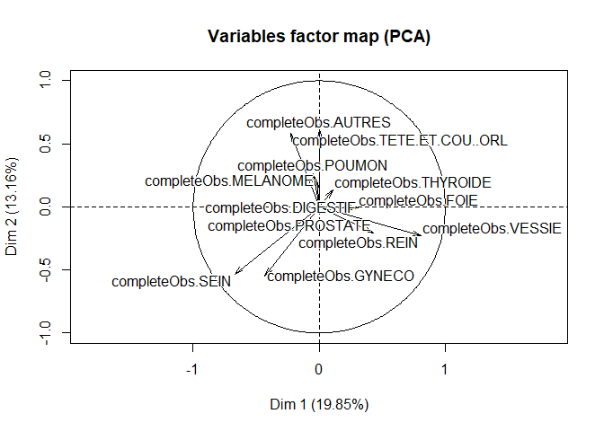
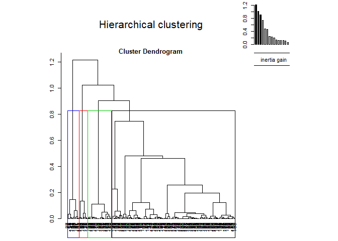
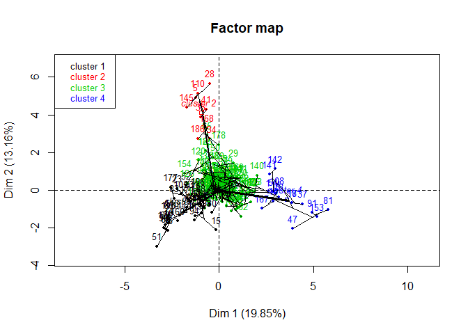

# Library

Loading the required libraries, setting overide and seed.


# Data Loading


```r
# loading the data
oncology.profile.dt<-fread(file.path("Data", "OncologyProfile.csv"))

head(oncology.profile.dt)
```

```
##    completeObs.SEIN completeObs.POUMON completeObs.GYNECO completeObs.PROSTATE
## 1:                0                  0                  0                   20
## 2:               80                  0                 15                    0
## 3:               31                  8                 12                   10
## 4:               20                 12                  5                   20
## 5:                0                  0                  0                    0
## 6:               15                 11                 11                   11
##    completeObs.VESSIE completeObs.REIN completeObs.DIGESTIF completeObs.FOIE
## 1:                 10               10                   60                0
## 2:                  0                0                    0                0
## 3:                  1                1                    8                0
## 4:                  6                6                   25                0
## 5:                  0                0                    0                0
## 6:                  4                4                   15                4
##    completeObs.THYROIDE completeObs.MELANOME completeObs.TETE.ET.COU..ORL
## 1:                    0                    0                            0
## 2:                    0                    0                            0
## 3:                    0                    1                            8
## 4:                    0                    0                            6
## 5:                    0                    5                           60
## 6:                    0                    0                            0
##    completeObs.AUTRES
## 1:                  0
## 2:                  5
## 3:                  0
## 4:                  0
## 5:                 35
## 6:                  0
```

# Data Depiction


# PCA

The FactoMineR pakage provided most of the functionality required for the PCA computation (such as the numerical calculation and also plotting) here for PCA.

**In practice**

1. Choose active variables

2. Rescale (or not) the variables

3. Perform PCA

4. Choose the number of dimensions to interpret

5. Joint analysis of the cloud of individuals and the cloud of variables

6. Use indicators to enrich interpretation

7. Go back to raw data for interpretation


**Code and Output**


```r
# This would create the approprate graph and factor plot
# note that this is only partial of the imputed data (withouted the fitted components.)

result.pca<-oncology.profile.dt%>%
  PCA(graph=TRUE)
```

<!-- --><!-- -->

**Linear composition for the Dim 1 and Dim 2**

The dim 1 and dim 2 of all the records can be acquired by the simple linear composition of the following values (eigenvectors). It is through such values that we acquire the individual factor map (PCA) depicted above for all records.

In essence, we translated the data into 2D, by rotating to a axes that comprise most of the data variations.


```r
data.frame(result.pca$var$coord)[1:2]
```

```
##                                     Dim.1        Dim.2
## completeObs.SEIN             -0.669445510 -0.532397497
## completeObs.POUMON           -0.050541286  0.266260775
## completeObs.GYNECO           -0.431773893 -0.550638808
## completeObs.PROSTATE          0.431805165 -0.206524603
## completeObs.VESSIE            0.807663544 -0.227232102
## completeObs.REIN              0.808481939 -0.226517708
## completeObs.DIGESTIF          0.311786417 -0.006406552
## completeObs.FOIE              0.302143750 -0.009099300
## completeObs.THYROIDE          0.106894891  0.136146237
## completeObs.MELANOME         -0.017924685  0.207326716
## completeObs.TETE.ET.COU..ORL -0.227654439  0.584504669
## completeObs.AUTRES            0.003455631  0.610690416
```


# Hierarchy clustering

In python sklearn world, this is also known as Agglomerative Clustering (**sklearn.cluster.AgglomerativeClustering**), it is however, more well known as **hclust** function from R **stats** library. In this case, I am using a higher level library - **FactoMineR** ( which provides additional plotting, anaylsis functionalities)

**Defination**: Recursively merges the pair of clusters that minimally increases a given linkage distance.

**Code and Output**


```r
# Clustering, auto nb of clusters:
hc <- HCPC(result.pca, nb.clust=-1,graph=FALSE, order=FALSE)
plot(hc, choice="tree")
```

<!-- -->

```r
plot(hc, choice="map")
```

<!-- -->

```r
# assigning the cluster's onto the raw data frame
oncology.profile.dt$cluster <-hc$data.clust$clust
```

In the dendrogram plot of clustering, the horizontal units are individual instances, while the vertical axes represent a proxy of linkage distance (distance between clusters). The number of clusters requires can be set by modifying at which point we would cut off the dendrogram.

There are various ways to proceed here, one could attempt to explain the individual factor components of Dim 1 and Dim 2, then use the above plots to illustrate the meaning behind Dim 1 and Dim 2. An alternative method would be to take the results of all these dimensional reduction and clustering onto the raw data. 


# Mathematics
## PCA

PCA can be thought of as an unsupervised learning problem, this is an analysis method that can be done with numerous methods. One of the more intuitive methods would be through eigen-decomposition. The whole process of obtaining principle components from a raw dataset can be simplified in 4 parts :

- Compute the covariance matrix of the whole dataset.
- Compute eigenvectors and the corresponding eigenvalues.
- Sort the eigenvectors by decreasing eigenvalues and choose k eigenvectors with the largest eigenvalues to form a d × k dimensional matrix W.
- Use this d × k eigenvector matrix to transform the samples onto the new subspace.

This is not the only way, similar (not identical) linear decomposition of the data can be done by singular value decomposition (SVD), which is perhaps more simplified numerically (for the mathematically inclined).


### Covariance

**Disclaimer** : Generally, it is important that the data is scaled (normalised) beforehand, otherwise instead of covariance, it will be based on correlation instead (which is the intention for the patient profile here).

**Definition** : The measure of the extent to which corresponding elements from two sets of ordered data move in the same direction. The formula is shown below denoted by cov(x,y) as the covariance of x and y.

$$
cov(x,y) = \frac{\sum (x_i-\hat{x})(y_i - \hat{y})}{N}
$$

Hence, for a data with 3 dimension of x, y, z variables.

$$
Cov({A}) = \begin{bmatrix}
Cov(x,x) , Cov(x,y), Cov(x,z)\\
Cov(y,x) , Cov(y,y), Cov(y,z)\\
Cov(z,x) , Cov(z,y), Cov(z,z)
\end{bmatrix}
$$

Since the covariance of a variable with itself is its variance (Cov(a,a)=Var(a)), in the main diagonal (Top left to bottom right), we actually have the variances of each initial variable. And since the covariance is commutative (Cov(a,b)=Cov(b,a)), the entries of the covariance matrix are symmetric with respect to the main diagonal, which means that the upper and the lower triangular portions are equal.

The relationship can thus be simplified to:

$$
Cov({A}) = \begin{bmatrix}
Var(x) , Cov(x,y), Cov(x,z)\\
Cov(x,y) , Var(y), Cov(y,z)\\
Cov(x,z) , Cov(y,z), Var(z)
\end{bmatrix}
$$


*What do the covariances that we have as entries of the matrix tell us about the correlations between the variables?*

It’s the sign of the covariance that matters :

- if positive then : the two variables increase or decrease together (correlated)
- if negative then : One increases when the other decreases (Inversely correlated)

Now, that we know that the covariance matrix is not more than a table that summaries the correlations between all the possible pairs of variables, let’s move to the next step.

### Eigenvectors

Eigenvectors and eigenvalues are the linear algebra concepts that we need to compute from the covariance matrix in order to determine the principal components of the data. They are simply mathematically transformation that would allow us to express the 

***Intuitively, an eigenvector is a vector whose direction remains unchanged when a linear transformation is applied to it.***


$$
[Covariance Matrix]\cdot [Eigenvector] = [Eigenvalues] \cdot [Eigenvector]
$$


$$
A v  = \lambda v
$$

The eigenvalues of A are roots of the characteristic equation

$$
det(A-\lambda I) = 0
$$

In which, we would acquire the lambda values if we were to solve the equation for $\lambda$.

### Simple Example - student scores

Let's start with something easier to follow and understands - 5 Students Scores among subjects of Math, English and Art.


```r
student.dt<-data.frame(student =1:5, math = c(90,60,90,60,30),english = c(60, 90,60 ,60 ,30), art = c(90,30,60,90,30))
student.dt
```

```
##   student math english art
## 1       1   90      60  90
## 2       2   60      90  30
## 3       3   90      60  60
## 4       4   60      60  90
## 5       5   30      30  30
```

Thus, the matrix of the data would be 

$$
A = \begin{bmatrix}
90 , 60, 90 \\
60 , 90, 30\\
90, 90, 60 \\
60, 60, 90\\
30, 30 , 30
\end{bmatrix}
$$

In which case, the mean fo the matrix $\tilde{A}$ would be


$$
\bar{A} = \begin{bmatrix}
66 , 60, 60
\end{bmatrix}
$$

It follows that, the covariance of the scores among the three variables are


```r
# data.frame(cov((student.dt[2:4])))
```

$$
Cov({A}) = 
\begin{bmatrix}
630 & 225 & 450\\
225 & 450 & 0\\
450&  0 & 900
\end{bmatrix}
$$

For Eigenvalues/vector decomposition, we would thus acquire


$$
det(Cov(A)-\lambda I) = 0
$$

$$
0 = det
\begin{pmatrix}
630-\lambda & 225 & 450 \\
225 & 450- \lambda & 0\\
450 & 0 & 900 -\lambda
\end{pmatrix}
$$

If we were to decompose it, we would acquire

$$
-\lambda^3 + 1584 \lambda^2 - 641520\lambda +25660800 = 0
$$

From which we can solve for the possibles values for $\lambda$ - eigenvalues.

# Hierarchical Clustering

**Methods** (for bottom-up approach):

It starts by treating each observation as a separate cluster 

Then, it repeatedly executes the following two steps (until all the clusters are merged)

1. Identify the two clusters that are closest together 

2. Merge the two most similar clusters

Finally, decide where to cut the hierarchical clusters to define the number of segments

**Options**

There are a few ways to determine how close two clusters are:

- **Complete linkage clustering**: Find the maximum possible distance between points belonging to two different clusters.
- **Single linkage clustering**: Find the minimum possible distance between points belonging to two different clusters.
- **Mean linkage clustering**: Find all possible pairwise distances for points belonging to two different clusters and then calculate the average.
- **Centroid linkage clustering**: Find the centroid of each cluster and calculate the distance between centroids of two clusters.

Complete linkage and mean linkage clustering are the ones used most often.


The distance calculation between points can also vary, while typically for numerical values we default to *euclidean*, *manhattan* is at times use for categorical values.


# References

1. https://towardsdatascience.com/the-mathematics-behind-principal-component-analysis-fff2d7f4b643

2. https://medium.com/@aptrishu/understanding-principle-component-analysis-e32be0253ef0

3. https://www.datacamp.com/community/tutorials/hierarchical-clustering-R
